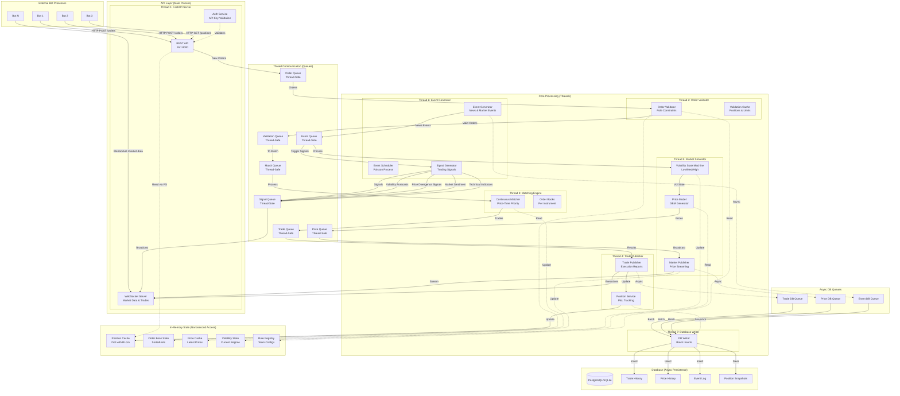

# System Architecture v2 - REST API & Multi-Threading

This document outlines the new multi-threaded, API-based architecture for the Intern Trading Game with hybrid in-memory/database design for maximum exchange performance.

## Overview

The system uses a hybrid architecture optimizing for exchange performance while maintaining data persistence. The critical trading path operates entirely in-memory, while a separate thread handles asynchronous database writes.

## Architecture Diagram



## Performance Architecture

### Critical Path
```
Order Submission → Validation → Matching → Position Update → Trade Notification
     ~100ns         ~500ns      ~2μs        ~100ns           ~1μs
                          Total: < 5 microseconds
```

### Async Path (Non-Blocking)
```
Trade → DB Queue → Batch Accumulation → Database Write
         ~100ns      (up to 100ms)        ~10-50ms
                    Never blocks trading
```

## Fast Path Components

### In-Memory Order Books
```python
class OrderBook:
    def __init__(self):
        # SortedList maintains order automatically
        self.bids = SortedList(key=lambda x: (-x.price, x.timestamp))
        self.asks = SortedList(key=lambda x: (x.price, x.timestamp))
        self.lock = threading.Lock()  # Per-instrument lock
```

### Position Cache
```python
class PositionCache:
    def __init__(self):
        self.positions = {}  # {team_id: {instrument: quantity}}
        self.lock = threading.RLock()  # Reentrant lock

    def update_atomic(self, team_id, instrument, delta):
        with self.lock:  # ~50ns overhead
            if team_id not in self.positions:
                self.positions[team_id] = {}
            current = self.positions[team_id].get(instrument, 0)
            self.positions[team_id][instrument] = current + delta
```

## Slow Path Components

### Database Writer Thread
```python
class DatabaseWriter:
    def __init__(self, db_conn):
        self.db = db_conn
        self.trade_batch = []
        self.price_batch = []

    def run(self):
        while True:
            # Accumulate trades for batch insert
            try:
                while len(self.trade_batch) < 1000:
                    trade = trade_queue.get(timeout=0.1)
                    self.trade_batch.append(trade)
            except Empty:
                pass

            # Batch insert (much faster than individual inserts)
            if self.trade_batch:
                self.db.insert_trades(self.trade_batch)
                self.trade_batch.clear()
```

## Hybrid Design Benefits

### Reliability Features
- **Crash Recovery**: Reload positions from last snapshot + trade log
- **Audit Trail**: Complete trade history in database
- **Analytics**: Can query historical data without impacting trading

### Memory Layout Optimization
```python
# Cache-friendly data structures
positions = {
    "team1": {"SPX_CALL": 10, "SPX_PUT": -5},  # Dict lookup: O(1)
    "team2": {"SPX_CALL": 20, "SPY_CALL": 15}
}

# Pre-allocated arrays for ultra-low latency
order_pool = [Order() for _ in range(100000)]  # Object pool
trade_pool = [Trade() for _ in range(100000)]  # Avoid allocation
```

## Database Schema

### Trade History Table
```sql
CREATE TABLE trades (
    id BIGSERIAL PRIMARY KEY,
    timestamp TIMESTAMP NOT NULL,
    buyer_id VARCHAR(50) NOT NULL,
    seller_id VARCHAR(50) NOT NULL,
    instrument VARCHAR(100) NOT NULL,
    price DECIMAL(10,2) NOT NULL,
    quantity INTEGER NOT NULL,
    buyer_fee DECIMAL(10,2),
    seller_fee DECIMAL(10,2),
    INDEX idx_timestamp (timestamp),
    INDEX idx_buyer (buyer_id),
    INDEX idx_seller (seller_id)
);
```

### Position Snapshots Table
```sql
CREATE TABLE position_snapshots (
    snapshot_time TIMESTAMP NOT NULL,
    team_id VARCHAR(50) NOT NULL,
    positions JSONB NOT NULL,  -- {"SPX_CALL": 10, "SPX_PUT": -5}
    pnl DECIMAL(15,2),
    PRIMARY KEY (snapshot_time, team_id)
);
```

## Thread Responsibilities

### Thread 1: FastAPI Server (Async)
- Handles all HTTP requests
- Manages WebSocket connections
- Validates API keys
- Routes orders to processing pipeline

### Thread 2: Order Validator
- Validates orders against role constraints
- Checks position limits (via OrderValidator constraints)
- Enforces trading rules
- Fast-fail invalid orders

### Thread 3: Matching Engine
- Continuous order matching
- Maintains order books
- Executes trades immediately
- Price-time priority algorithm

### Thread 4: Trade Publisher & Position Service
- Broadcasts executions to bots
- Updates position tracking
- Calculates P&L
- Triggers async database writes

### Thread 5: Market Simulator
- Runs price generation model
- Manages volatility regimes
- Broadcasts market data
- Handles regime transitions

### Thread 6: Event Generator
- Schedules random events
- Processes event impacts
- Generates trading signals
- Maintains event history

### Thread 7: Database Writer
- Batch inserts trades to database
- Saves price history asynchronously
- Stores event logs
- Takes periodic position snapshots

## Configuration

### Performance Tuning
```yaml
performance:
  order_queue_size: 10000
  batch_size: 1000
  db_write_interval_ms: 100
  position_snapshot_interval_s: 60

threading:
  matching_engine_priority: high
  db_writer_priority: low

memory:
  preallocate_orders: 100000
  preallocate_trades: 100000
  position_cache_size: 1000
```

## Next Steps

1. Implement in-memory matching engine with SortedList
2. Add position cache with RLock
3. Create database writer thread
4. Implement batch insert logic
5. Add position snapshot system
6. Performance benchmark (target: <10μs per trade)
