# Layered Architecture v3 - Current Implementation

This document describes the current layered architecture of the Intern Trading Game as actually implemented, showing how the system is organized into distinct layers with clear responsibilities and dependencies.

## Current Implementation Status

This architecture represents the **actual current state** of the system, which implements the core trading pipeline. The system currently includes:

- DONE
  - Order submission and validation
  - Order matching and trade execution
  - Position tracking and fee calculation
  - Real-time WebSocket notifications
- TODO
  - Market simulation (not yet implemented)
  - Event generation (not yet implemented)
  - Database persistence (not yet implemented)

## Architecture Layers

The system follows a clean layered architecture with six distinct layers:

```mermaid
graph TB
    subgraph "External Layer"
        BOTS[Trading Bots<br/>External Processes]
        ADMIN[Admin Tools<br/>Monitoring]
    end

    subgraph "API Layer (Infrastructure)"
        REST[REST API<br/>FastAPI Server<br/>Main Thread]
        WS[WebSocket Server<br/>Real-time Updates]
        AUTH[Authentication<br/>API Key Management]
    end

    subgraph "Thread Layer (Infrastructure)"
        VT[Validator Thread<br/>Order Queue Processing<br/>Thread 2]
        MT[Matching Thread<br/>Exchange Interaction<br/>Thread 3]
        PT[Publisher Thread<br/>Trade Processing<br/>Thread 4]
        WT[WebSocket Thread<br/>Message Delivery<br/>Thread 8]
    end

    subgraph "Service Layer (Business Logic)"
        VS[OrderValidationService<br/>Business Rules]
        MS[OrderMatchingService<br/>Exchange Submission]
        TS[TradeProcessingService<br/>Trade Orchestration]
        FS[TradingFeeService<br/>Fee Calculation]
        PS[PositionManagementService<br/>Position Tracking]
    end

    subgraph "Core Domain Layer"
        EX[ExchangeVenue<br/>Central Exchange]
        OV[ConstraintBasedOrderValidator<br/>Validation Engine]
        ME[ContinuousMatchingEngine<br/>Price-Time Priority]
        OB[OrderBook<br/>Bid/Ask Management]
        INS[Instruments<br/>Option Definitions]
    end

    subgraph "Data Layer (In-Memory)"
        POS[(positions<br/>Dict with RLock)]
        ORDERS[(orders_this_tick<br/>Dict with RLock)]
        BOOKS[(Order Books<br/>In ExchangeVenue)]
        RESP[(pending_orders<br/>Response Events)]
        Q1[order_queue<br/>API -> Validator]
        Q2[validation_queue<br/>Validator -> Matcher]
        Q3[match_queue<br/>For matching engine]
        Q4[trade_queue<br/>Matcher -> Publisher]
        Q5[response_queue<br/>For order responses]
        Q6[websocket_queue<br/>-> WebSocket]
    end

    %% External connections
    BOTS -->|HTTP POST /orders| REST
    BOTS -->|WebSocket /ws| WS
    ADMIN -->|HTTP GET /positions| REST

    %% API to Thread connections
    REST -->|Enqueue Order| Q1
    AUTH -.->|Validates| REST
    WS -.->|Auth Check| AUTH

    %% Thread queue flow
    VT -->|Reads| Q1
    VT -->|Writes| Q2
    MT -->|Reads| Q2
    MT -->|Writes| Q3
    MT -->|Reads| Q3
    MT -->|Writes| Q4
    PT -->|Reads| Q4
    PT -->|Writes| Q6
    WT -->|Reads| Q6

    %% Thread to Service connections
    VT -->|Uses| VS
    MT -->|Uses| MS
    PT -->|Uses| TS
    PT -->|Uses| FS
    PT -->|Uses| PS

    %% Service dependencies
    TS -->|Orchestrates| FS
    TS -->|Orchestrates| PS
    VS -->|Uses| OV
    MS -->|Uses| EX

    %% Service to Core connections
    VS -->|Validates With| OV
    MS -->|Submits To| EX
    EX -->|Contains| ME
    ME -->|Updates| OB
    EX -->|Manages| INS

    %% Data access patterns
    VS -.->|Reads| POS
    VS -.->|Reads| ORDERS
    PS -->|Updates| POS
    PT -.->|Updates| RESP
    EX -->|Maintains| BOOKS

    %% Response flow
    VT -.->|Sets Event| RESP
    MT -.->|Sets Event| RESP
    PT -.->|Sets Event| RESP

    style BOTS fill:#e1f5fe
    style REST fill:#fff3e0
    style WS fill:#fff3e0
    style AUTH fill:#fff3e0
    style VT fill:#f3e5f5
    style MT fill:#f3e5f5
    style PT fill:#f3e5f5
    style WT fill:#f3e5f5
    style VS fill:#e8f5e9
    style MS fill:#e8f5e9
    style TS fill:#e8f5e9
    style FS fill:#e8f5e9
    style PS fill:#e8f5e9
    style EX fill:#fff9c4
    style OV fill:#fff9c4
    style ME fill:#fff9c4
    style OB fill:#fff9c4
    style INS fill:#fff9c4
    style POS fill:#ffebee
    style ORDERS fill:#ffebee
    style BOOKS fill:#ffebee
```



## Layer Descriptions

### 1. External Layer
**Purpose**: External systems and clients that interact with the trading system.

**Components**:

- **Trading Bots**: External processes that submit orders and receive market data
- **Admin Tools**: Monitoring and management interfaces

**Characteristics**:

- No knowledge of internal implementation
- Communicate only through published APIs
- Can be written in any language

### 2. API Layer (Infrastructure)
**Purpose**: HTTP and WebSocket interfaces for external communication.

**Components**:

- **REST API**: FastAPI server running in the main thread
  - `/auth/register` - Team registration
  - `/orders` - Order submission
  - `/orders/{order_id}` - Order cancellation
  - `/positions/{team_id}` - Position queries
- **WebSocket Server**: Real-time execution reports and position updates
- **Authentication**: API key validation using `team_registry`

**Responsibilities**:

- Protocol handling (HTTP/WebSocket)
- Request validation and serialization
- Authentication and authorization
- Queue message creation for order processing

**Implementation Details**:

- FastAPI with async/await for high performance
- Lifespan context manager for startup/shutdown
- Thread-safe team registry for API key management

### 3. Thread Layer (Infrastructure)
**Purpose**: Concurrent processing of orders through the trading pipeline.

**Current Threads** (4 threads implemented):

1. **Main Thread**: FastAPI server (not shown as separate thread)
2. **Validator Thread**: Processes order queue, validates constraints
3. **Matching Thread**: Submits validated orders to exchange
4. **Publisher Thread**: Processes trades, updates positions, calculates fees
5. **WebSocket Thread**: Bridges sync queues with async WebSocket delivery

**Responsibilities**:

- Queue processing with blocking `get()` calls
- Thread lifecycle management
- Error handling and logging
- Service initialization at thread startup

**Key Implementation Details**:

- Daemon threads for automatic cleanup
- Graceful shutdown via `None` sentinel values
- No shared service instances between threads
- FIFO queue processing for fairness

### 4. Service Layer (Business Logic)
**Purpose**: Encapsulates all business logic and orchestration.

**Implemented Services**:

- **OrderValidationService**:
  - Validates new orders against constraints
  - Handles order cancellations with ownership checks
  - Returns standardized `OrderResult` objects
- **OrderMatchingService**:
  - Submits orders to exchange
  - Handles exchange exceptions
  - Provides consistent error responses
- **TradeProcessingService**:
  - Orchestrates trade execution flow
  - Calculates fees via `TradingFeeService`
  - Updates positions via `PositionManagementService`
  - Generates execution reports for WebSocket
- **TradingFeeService**:
  - Role-based fee calculation
  - Maker/taker fee logic
  - Configurable fee schedules
- **PositionManagementService**:
  - Thread-safe position updates
  - Atomic position modifications
  - Position queries

**Key Design Principles**:

- Services are stateless (state in data layer)
- Services don't know about threads or queues
- Clear interfaces with single responsibilities
- Dependency injection for testability

### 5. Core Domain Layer
**Purpose**: Core trading domain models and exchange logic.

**Components**:

- **ExchangeVenue**: Central exchange managing instruments and order books
- **ConstraintBasedOrderValidator**: Pluggable validation with role-specific rules
- **ContinuousMatchingEngine**: Price-time priority matching algorithm
- **OrderBook**: Efficient bid/ask management with sorted lists
- **Instruments**: Option contract definitions

**Responsibilities**:

- Order matching algorithm implementation
- Constraint validation logic
- Trade generation from matched orders
- Market structure rule enforcement

**Implementation Details**:

- Thread-safe order book operations
- Immutable order and trade objects
- Rich domain models (not anemic)
- No infrastructure dependencies

### 6. Data Layer
**Purpose**: In-memory state management and inter-thread communication.

**State Storage**:

- **positions**: Team positions with `RLock` for thread safety
- **orders_this_tick**: Order count tracking per tick
- **Order Books**: Maintained within `ExchangeVenue`
- **pending_orders**: Threading events for synchronous responses

**Message Queues** (all using Python's thread-safe `Queue`):

- **order_queue**: REST API -> Validator Thread
- **validation_queue**: Validator -> Matcher (currently unused)
- **match_queue**: For matching engine operations
- **trade_queue**: Matcher -> Publisher Thread
- **response_queue**: For order response coordination
- **websocket_queue**: All threads -> WebSocket Thread

**Key Design Decisions**:

- All state is in-memory (no database yet)
- Explicit locking with `RLock` for reentrancy
- Queue-based actor model for thread communication
- Blocking queue operations for simplicity

## Dependency Rules

The architecture enforces strict dependency rules:

1. **Dependencies only flow downward** - Higher layers can depend on lower layers, never the reverse
2. **Skip layers when appropriate** - Not every layer needs to be involved in every operation
3. **Infrastructure wraps business** - Threads/API are infrastructure, Services/Core are business
4. **Core domain is pure** - No external dependencies, just business logic

## Data Flow Example

### Complete Order Flow (Current Implementation)
```
1. Bot -> REST API (POST /orders)
2. REST API -> order_queue
3. Validator Thread -> OrderValidationService -> ConstraintBasedOrderValidator
4. If valid: -> match_queue
5. Matching Thread -> OrderMatchingService -> ExchangeVenue -> ContinuousMatchingEngine
6. If matched: -> trade_queue
7. Publisher Thread -> TradeProcessingService:
   - -> TradingFeeService (calculate fees)
   - -> PositionManagementService (update positions)
   - -> websocket_queue (execution report)
8. WebSocket Thread -> WebSocketManager -> Bot
```

## Key Architectural Benefits

1. **Testability**: Each layer can be tested independently

   - Services tested without threads
   - Core domain tested without services
   - Integration tests at multiple levels

2. **Maintainability**: Clear responsibilities and boundaries

   - Easy to locate functionality
   - Changes isolated to specific layers

3. **Performance**: Optimized for low latency

   - In-memory operations only
   - Minimal lock contention
   - Queue-based decoupling

4. **Extensibility**: Easy to add new components

   - New services plug in easily
   - New constraints without core changes
   - Future database layer won't impact core

## Future Enhancements (Not Yet Implemented)

Based on architecture v2, future additions include:

1. **Market Simulation Layer**:
   - Price generation thread (GBM model)
   - Volatility state machine
   - Market data distribution

2. **Event System**:
   - News event generation
   - Trading signal generation
   - Event impact on volatility

3. **Persistence Layer**:
   - Database writer thread
   - Async trade recording
   - Position snapshots
   - Crash recovery

4. **Enhanced Features**:
   - Circuit breakers
   - More order types
   - Multi-instrument trading
   - Risk management

## Current Limitations

1. No market prices (orders must cross to match)
2. No persistence (everything lost on restart)
3. No market events or volatility
4. Limited to simple limit/market orders
5. No replay or audit capabilities

This architecture provides a solid foundation for the current trading system while maintaining clear extension points for planned enhancements.
