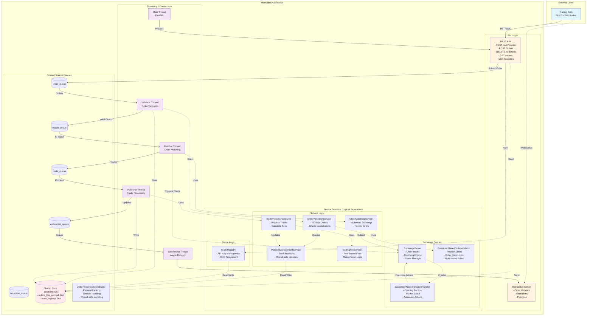
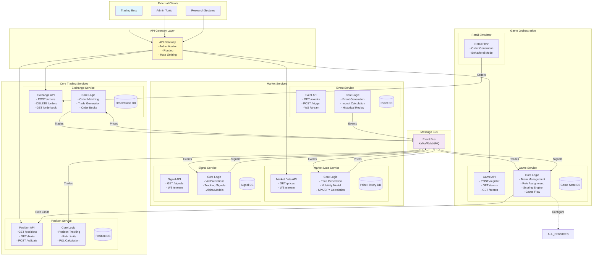

# Architecture v4: Service-Oriented Design

This document presents the service-oriented architecture for the Intern Trading Game, showing both the current monolithic implementation and the target microservices vision.

## Executive Summary

The system is designed with clear service boundaries that enable future decomposition into microservices. Currently implemented as a monolith with service-oriented internal structure, the architecture supports:

- **Exchange Service**: Pure order matching and trade generation
- **Position Service**: Position tracking and risk management
- **Market Data Service**: Price generation and distribution (planned)
- **Event Service**: News and market events (planned)
- **Signal Service**: Trading signals and alpha (planned)
- **Game Service**: Orchestration, teams, and scoring

## Current Architecture (Implemented)

The system currently runs as a monolithic application with internal service boundaries:



### Current Implementation Details

1. **Single Process**: Everything runs in one Python process
2. **Thread Count**: 5 threads total (Main + 4 daemon threads)
3. **Thread Communication**: Queue-based message passing
4. **Shared State**: Protected by RLock for thread safety
5. **Service Boundaries**: Clear domain separation achieved
   - Exchange domain: core types, order book, matching, validation, phase transitions
   - Underlying domain: market data for underlying assets
   - Signals domain: trading signals for roles
   - Events domain: market news events
   - Game domain: configuration and game-specific logic
6. **API Surface**: Single REST API with 5 endpoints + WebSocket endpoint
7. **Phase Transitions**: Time-based checking with automatic market operations

### Queue Usage (Current)

- **order_queue**: REST API → Validator Thread
- **match_queue**: Validator Thread → Matching Thread
- **trade_queue**: Matching Thread → Publisher Thread
- **websocket_queue**: All threads → WebSocket Thread
- **response_queue**: For synchronous order responses
- **validation_queue**: Defined but not used (legacy)

### Shared State (Current)

- **positions**: Team positions (Dict[str, Dict[str, int]])
- **orders_this_second**: Order rate limiting (Dict[str, int])
- **team_registry**: Registered teams (Dict[str, TeamInfo])
- ~~**pending_orders**: Threading events for sync responses~~ (Replaced by [OrderResponseCoordinator](explanation/order-response-coordination.md))
- ~~**order_responses**: Order response cache~~ (Replaced by [OrderResponseCoordinator](explanation/order-response-coordination.md))

## Target Architecture (Future Vision)

The target architecture decomposes the monolith into independent services:



### Target Architecture Benefits

1. **Independent Scaling**: Scale each service based on load
2. **Technology Flexibility**: Use optimal tech stack per service
3. **Fault Isolation**: Service failures don't cascade
4. **Independent Deployment**: Deploy services separately
5. **Clear Ownership**: Teams own specific services

## Service Boundaries and Responsibilities

### Exchange Service
**Owns**: Order matching, trade generation, order books, phase transitions

**Responsibilities**:

- Accept and validate orders (format, instrument exists)
- Match orders using configured algorithm
- Generate trades with unique IDs
- Maintain order book state
- Publish trade events
- Manage market phases and transitions
- Execute opening auctions automatically
- Cancel all orders at market close

**Does NOT Own**:

- Position tracking
- Risk limits
- Team/role concepts
- Market prices (receives from Market Data)

### Position Service
**Owns**: Position tracking, risk management

**Responsibilities**:

- Track positions by account/instrument
- Validate position limits
- Calculate P&L
- Provide position queries
- Monitor exposure

**Does NOT Own**:

- Order matching
- Trade generation
- Team management

### Market Data Service
**Owns**: Price generation, market data distribution

**Responsibilities**:

- Generate realistic price movements
- Implement volatility regimes
- Maintain SPX/SPY correlation
- Distribute market data
- Store price history

**Does NOT Own**:

- Order matching
- Position tracking
- Trade execution

### Event Service
**Owns**: Market events, news generation

**Responsibilities**:

- Generate/replay market events
- Calculate event impacts
- Distribute events to subscribers
- Maintain event history

**Does NOT Own**:

- Direct price manipulation
- Trade generation
- Signal creation

### Signal Service
**Owns**: Trading signals, alpha generation

**Responsibilities**:

- Generate role-specific signals
- Implement alpha models
- Research integration
- Signal distribution

**Does NOT Own**:

- Trade execution
- Position management
- Event generation

### Game Service
**Owns**: Game orchestration, team management

**Responsibilities**:

- Team registration and auth
- Role assignment
- Configure other services
- Score calculation
- Game flow control

**Does NOT Own**:

- Order matching
- Price generation
- Direct position tracking

## Migration Roadmap

### Phase 1: Code Organization (Current)

- ✅ Reorganize code into service-oriented structure
- ✅ Maintain monolithic deployment
- ✅ Establish logical service boundaries

### Phase 2: Internal APIs (Next)

- [ ] Create internal service interfaces
- [ ] Replace direct function calls with service APIs
- [ ] Maintain queue-based async communication
- [ ] Add service-level testing

### Phase 3: State Isolation

- [ ] Move shared state into services
- [ ] Each service owns its data
- [ ] Replace shared dicts with service calls
- [ ] Add caching where needed

### Phase 4: Thread Ownership

- [ ] Assign threads to specific services
- [ ] Create Position Tracker thread
- [ ] Create Market Data thread
- [ ] Refactor Publisher thread

### Phase 5: Database Layer

- [ ] Add persistence to each service
- [ ] Implement event sourcing for trades
- [ ] Add audit trails
- [ ] Enable crash recovery

### Phase 6: Service Extraction

- [ ] Extract Position Service first
- [ ] Add REST/gRPC APIs
- [ ] Implement service discovery
- [ ] Add circuit breakers

### Phase 7: Full Microservices

- [ ] Deploy services independently
- [ ] Implement service mesh
- [ ] Add monitoring/tracing
- [ ] Complete migration

## Comparison: Current vs Target

| Aspect | Current Implementation | Target Architecture |
|--------|----------------------|-------------------|
| **Deployment** | Single Python process | Multiple containers/services |
| **Communication** | Queues + shared memory | REST/gRPC + Message Bus |
| **State Management** | Shared dicts with locks | Service-owned databases |
| **Threading** | Functional separation | Service-owned thread pools |
| **Scaling** | Vertical only | Horizontal per service |
| **Testing** | Integration-heavy | Service isolation |
| **Failure Modes** | All or nothing | Graceful degradation |
| **Development** | Single codebase | Service repositories |
| **Monitoring** | Basic logging | Distributed tracing |
| **Configuration** | Single config file | Service configs |

## Implementation Guidelines

### Current Development (Monolith)

1. Maintain service boundaries in code
2. Use interfaces between services
3. Avoid cross-service imports
4. Keep state access centralized
5. Write service-level tests

### Future Development (Microservices)

1. Design API-first
2. Use async messaging for events
3. Implement idempotency
4. Handle partial failures
5. Version APIs carefully

## Key Design Decisions

### Why Service-Oriented?

1. **Reusability**: Services work for game, backtesting, or production
2. **Clarity**: Clear ownership and responsibilities
3. **Scalability**: Natural decomposition points
4. **Flexibility**: Mix and match services as needed

### Why Start Monolithic?

1. **Simplicity**: Easier to develop and debug
2. **Performance**: No network overhead
3. **Consistency**: Shared state is simpler
4. **Iteration**: Faster to refactor

### When to Split Services?

1. When scaling needs differ significantly
2. When teams need independent deployment
3. When technology requirements diverge
4. When failure isolation becomes critical

### Phase Transition Design Decision

**Time-Based vs Event-Driven**: Phase transitions use time-based checking rather than event-driven mechanisms

**Rationale**:

1. **Predictability**: Market operations execute reliably even under high/low load
2. **Simplicity**: No complex event coordination or race conditions
3. **Performance**: Minimal overhead (100ms checks) with configurable intervals
4. **Reliability**: Guaranteed execution of critical operations like opening auctions
5. **Future-Ready**: Easy migration to event bus when moving to microservices

## Implementation Plan

### Immediate Actions (This Sprint)

#### 1. Domain Reorganization ✅ COMPLETED
**Goal**: Create clear service boundaries in code structure

```
├── domain/
│   ├── exchange/           # Exchange-related code
│   │   ├── core/          # order.py, trade.py, instrument.py ✅
│   │   ├── book/          # order_book.py, matching_engine.py ✅
│   │   ├── validation/    # order_validator.py ✅
│   │   ├── venue.py       # ✅
│   │   ├── order_result.py
│   │   └── types.py
│   │
│   ├── positions/          # Position tracking domain (empty, ready for use)
│   │
│   ├── underlying/         # Underlying market data domain ✅
│   │   └── market_data.py # UnderlyingMarketData class
│   │
│   ├── events/            # Event system domain ✅
│   │   └── news_event.py  # NewsEvent class
│   │
│   ├── signals/           # Trading signals domain ✅
│   │   └── signal.py      # Signal class
│   │
│   └── game/              # Game-specific domain ✅
│       └── config.py      # GameConfig class
```

**Completed Tasks**:

- [x] Create new directory structure
- [x] Move instrument.py from models/ to exchange/core/
- [x] Move order.py and trade.py to exchange/core/
- [x] Move order_book.py to exchange/book/
- [x] Move matching_engine.py to exchange/book/
- [x] Move validation/ directory to exchange/validation/
- [x] Split models/core.py into appropriate domains:
  - UnderlyingMarketData → domain/underlying/ (made product-agnostic)
  - Signal → domain/signals/ (separate from events)
  - NewsEvent → domain/events/
  - GameConfig → domain/game/
- [x] Update all imports throughout codebase
- [x] Delete models/ directory

**Additional Work**: Moved trade processing services to positions domain (commit 11af614)
- Moved TradeProcessingService, TradingFeeService, PositionManagementService
- Created FeeSchedule domain model in positions/models.py
- Simplified fee configuration by removing redundant FeeConfig class

#### 2. Interface Cleanup ✅ MOSTLY COMPLETED
**Goal**: Fix inconsistencies and remove unused code

**Tasks**:

- [x] Remove unused `metadata` field from ValidationContext (commit 9902a17)
- [x] Fix docstring: "orders_this_tick" → "orders_this_second" (commit 95ad613)
- [ ] Rename "TradingContext" sections in docstrings (deferred - not critical)
- [x] Move ValidationContext to exchange/validation/interfaces.py (commit 95ad613)
- [x] Create clear service interfaces in each domain (basic protocols created)

#### 3. Service API Definition ✅ COMPLETED
**Goal**: Define clear APIs for each service domain

**Tasks**:

- [x] Create exchange/api.py with exchange operations (commit 3ec5133)
- [x] Create positions/api.py with position operations (commit 3ec5133)
- [ ] Create market/api.py with market data operations (not needed yet)
- [x] Create game/api.py with game operations (commit 3ec5133)
- [x] Document API contracts (protocols have docstrings)

### Next Sprint Actions

#### 4. API Endpoint Separation (IN PROGRESS)
**Goal**: Split REST endpoints by service domain

**Current**:
```
POST /auth/register
POST /orders
DELETE /orders/{id}
GET /orders
GET /positions
```

**Target**:
```
# Exchange API
POST   /exchange/orders
DELETE /exchange/orders/{id}
GET    /exchange/orders
GET    /exchange/orderbook/{instrument}

# Position API
GET    /positions/{team_id}
GET    /positions/{team_id}/limits

# Game API
POST   /game/teams/register
GET    /game/teams/{team_id}
```

**Tasks**:

- [x] Create separate FastAPI routers per service (exchange.py, game.py created)
- [x] Implement new endpoint structure (paths updated to service-oriented)
- [x] ~~Maintain backward compatibility~~ (not needed per user)
- [x] Update API documentation

**Completed**:

- Created exchange.py router with order endpoints (commit 2b2c561)
- Created game.py router with team registration (commit c3cdca3)
- Added get_team_by_name() to prevent duplicate team names
- Added GET /exchange/orderbook/{instrument_id} endpoint
- Added GET /game/teams/{team_id} endpoint
- Updated all endpoint paths to service-oriented structure
- Updated REST API documentation with new paths and endpoints

#### 5. Thread Ownership ✅ **COMPLETE**
**Goal**: Assign threads to specific services

**Tasks**:

- [x] Create PositionTrackerThread in positions domain
- [x] Move position update logic from PublisherThread
- [x] Create service-specific thread modules
- [x] Update thread initialization

**Completed**:

- Created `domain/exchange/threads.py` with Exchange Service threads (validator, matching)
- Created `domain/positions/threads.py` with Position Service threads (position tracker)
- Created `infrastructure/communication/threads.py` with cross-domain communication threads (trade publisher, websocket)
- Updated all imports and test fixtures to use new thread locations
- Removed old `infrastructure/threads/` directory entirely
- Implemented wrapper pattern for dependency injection to avoid circular imports
- Established proper service-oriented thread ownership where each service owns its threading concerns

### Medium-term Actions (Next Month)

#### ✅ 6. State Isolation (Partially Complete)
**Goal**: Move shared state into services

**Tasks**:

- [x] 6.1 Move rate limiting state into OrderValidationService (Completed)
- [x] 6.2 Move game state into GameService (Completed by user)
- [x] 6.3 Move positions dict into PositionService (Completed)
- [ ] 6.4 Move team_registry into GameService (TODO)
- [ ] 6.5 Remove remaining direct state access

**Completed**:

- Phase 6.1: Implemented proper per-second rate limiting with window-based approach
  - Added RateLimitWindow dataclass for tracking orders per second
  - Fixed broken rate limiter that never reset counts
  - Used TDD approach with comprehensive functional tests
- Phase 6.3: Refactored PositionManagementService to own state internally
  - Moved from external state parameters to internal _positions dict and _lock
  - Updated OrderValidationService to use position_service instead of callback
  - Fixed all tests to use service methods instead of direct dict access

#### 7. Event Bus Implementation
**Goal**: Replace direct queue usage with event bus

**Tasks**:

- [ ] Implement internal event bus abstraction
- [ ] Define event types and schemas
- [ ] Convert queue communications to events
- [ ] Add event logging and monitoring

#### 8. Service Testing
**Goal**: Comprehensive service-level tests

**Tasks**:

- [ ] Create service interface tests
- [ ] Add integration tests per service
- [ ] Mock inter-service communications
- [ ] Performance benchmarks

### Long-term Actions (Next Quarter)

#### 9. Database Layer
**Goal**: Add persistence to services

**Tasks**:

- [ ] Design database schemas per service
- [ ] Implement repositories
- [ ] Add database migrations
- [ ] Create backup/restore procedures

#### 10. Service Extraction
**Goal**: Extract first service (Position Service)

**Tasks**:

- [ ] Create standalone Position Service project
- [ ] Implement REST/gRPC API
- [ ] Add service discovery
- [ ] Deploy as separate process
- [ ] Monitor and optimize

### Success Metrics

1. **Code Organization**

   - Clear service boundaries in code
   - No cross-service imports
   - Service-specific tests

2. **API Design**

   - RESTful service APIs
   - Clear API documentation
   - Version management

3. **Performance**

   - Maintain < 1ms order validation
   - No performance regression
   - Improved test execution time

4. **Development Velocity**

   - Easier to add new features
   - Parallel development on services
   - Reduced merge conflicts

## Conclusion

This architecture provides a clear path from the current monolithic implementation to a scalable microservices architecture. By maintaining service boundaries from the start, we enable future decomposition while keeping current development simple and efficient.

The key is that service boundaries are about **logical separation** and **clear interfaces**, not physical separation. This allows us to gain many benefits of service-oriented architecture while avoiding the complexity of distributed systems until truly needed.
