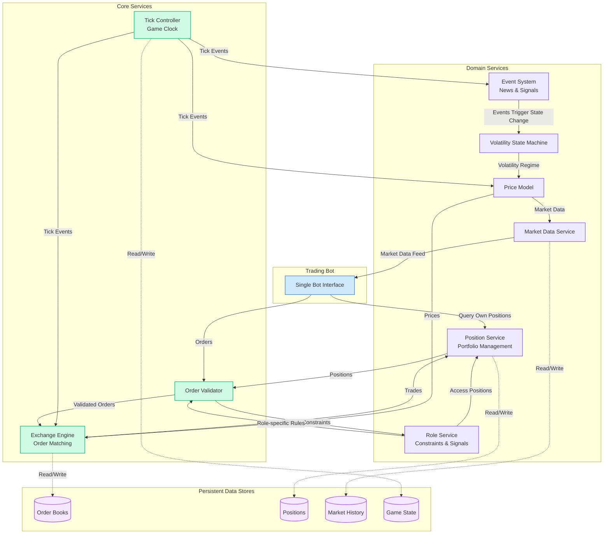

# System Architecture

This document outlines the technical architecture.

## Overview

Core services handle game mechanics and order matching, domain services manage business logic and market simulation, while persistent data stores maintain game state. The design emphasizes extensibility, allowing new trading roles and market events to be added without modifying existing components.

## Architecture Diagram

## Component Responsibilities

### Core Services

**Tick Controller**
- Orchestrates 5-minute tick cycles (T+0:00 to T+5:00)
- Publishes tick events to all domain services at precise intervals
- Enforces trading schedule (Tuesday/Thursday, 9:30 AM - 3:00 PM CT)
- Manages order submission window (T+0:30 to T+3:00)
- Triggers batch matching at T+3:30

**Exchange Engine**
- Executes price-time priority matching for OPTIONS only
- Maintains separate order books for each option instrument
- Processes market, limit, and quote orders
- Creates trade records with appropriate fees/rebates

**Order Validator**
- Pre-validates all incoming orders before submission
- Queries Position Service for current holdings
- Delegates role-specific checks to Role Service
- Validates order types allowed per role
- Returns detailed rejection reasons

### Domain Services

**Price Model**
- Generates synthetic SPX and SPY underlying prices only
- Implements correlated Geometric Brownian Motion
- Maintains SPX-SPY correlation (~0.98) with tracking error
- Applies volatility parameters from state machine
- Publishes new prices at each tick start (T+0:00)

**Volatility State Machine**
- Manages three regimes: Low (10%), Medium (20%), High (50%) annualized
- Processes event impacts to trigger transitions
- Implements regime persistence via Markov chains
- Low regime: 50-200 ticks typical duration
- Medium regime: 30-100 ticks typical duration
- High regime: 10-50 ticks typical duration

**Event System**
- Generates news events via Poisson process (λ=1 per 1-4 hours)
- Creates event types: regime shifters (40%), price jumpers (30%), false signals (30%)
- Publishes event impacts to trigger state changes
- Distributes advance signals to specific roles
- Manages signal accuracy (66% for hedge funds, 80% for arbitrage)

**Role Service**
- **Market Maker**: ±50 position limit, 80% quoting requirement, +$0.02 maker rebate
- **Hedge Fund**: ±50 delta neutrality, 1-5 tick advance volatility signals
- **Arbitrage Desk**: 2:1 SPX/SPY ratio constraint, real-time tracking error signals
- Validates role-specific order types and constraints
- Manages differential fee structures

**Position Service**
- Tracks positions by player, instrument, and quantity
- Calculates real-time P&L including all fees
- Computes portfolio Greeks (delta, gamma, vega, theta)
- Monitors compliance with role constraints
- Provides position snapshots for validation

**Market Data Service**
- Publishes underlying prices from Price Model
- Distributes 5-level order book depth for options
- Stores all trades with timestamps and participants
- Maintains historical data for backtesting
- Streams updates at tick boundaries

### Data Stores

- **Order Books**: Active limit/quote orders per option
- **Positions**: Player holdings with quantities, average prices, and P&L
- **Market History**: Complete time series of prices, trades, and snapshots
- **Game State**: Session config, player mappings, current tick, scores
