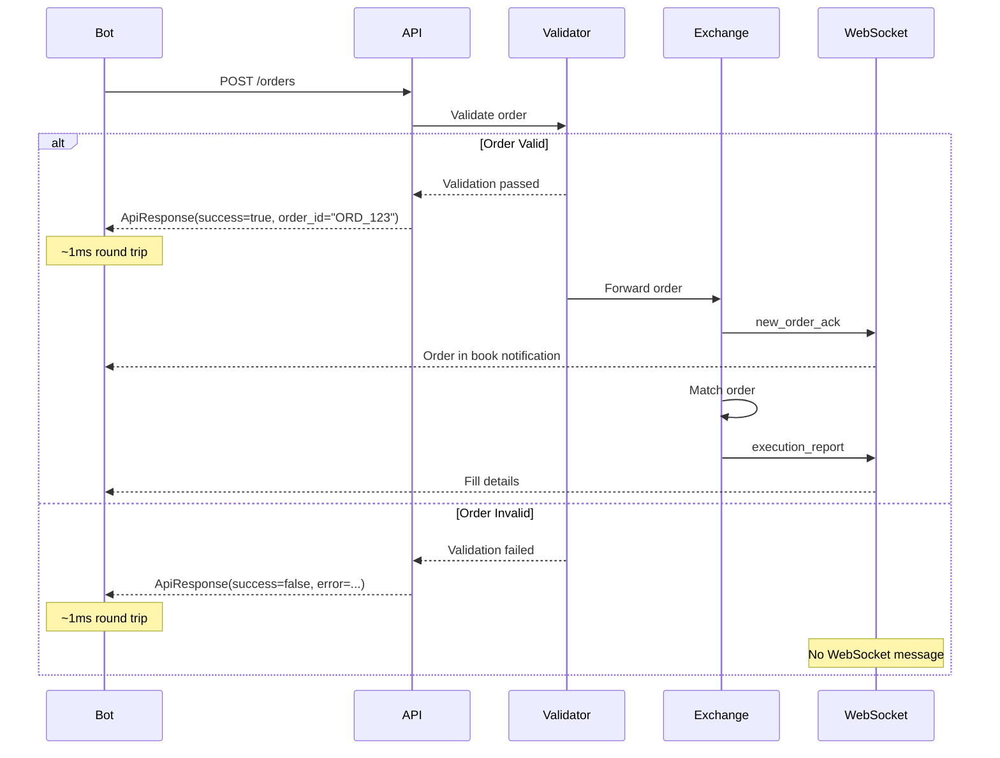
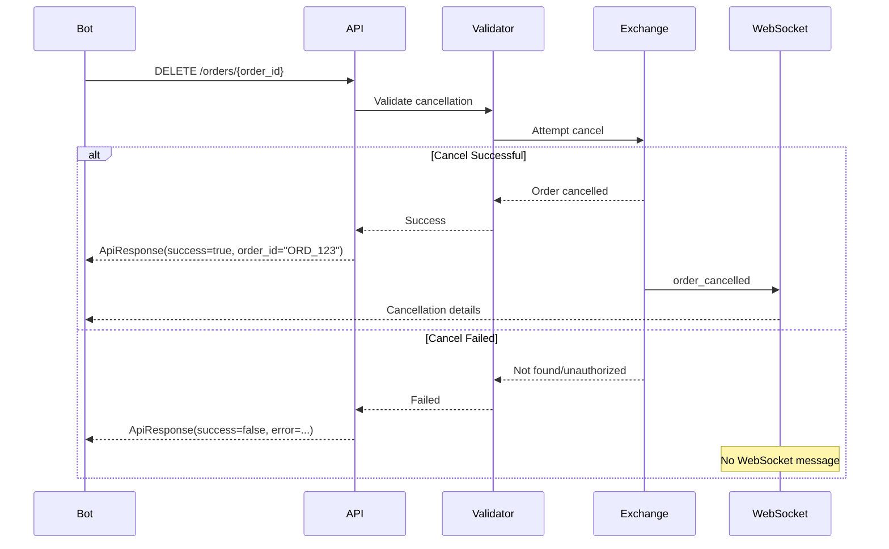

# API Communication Design

This document explains the communication architecture between trading bots and the exchange, focusing on the separation between synchronous API responses and asynchronous WebSocket events.

## Overview

The Intern Trading Game uses a hybrid communication model that optimizes for both low latency and comprehensive event reporting:

- **REST API**: Synchronous validation responses (~1ms latency)
- **WebSocket**: Asynchronous execution events (real-time updates)

This design ensures bots receive immediate feedback for their requests while also getting detailed execution information as it happens.

## Design Principles

### 1. Clear Separation of Concerns

The system separates validation from execution:

- **Validation Layer** (Validator Thread) → REST API responses only
- **Execution Layer** (Exchange/Matcher) → WebSocket events only

This separation provides several benefits:

- Predictable API latency (always ~1ms)
- No confusion about duplicate messages
- Clear ownership of each communication type
- Simplified debugging and monitoring

The [OrderResponseCoordinator](order-response-coordination.md) service manages the synchronization between these layers without introducing shared global state. See [Internal Response Coordination](internal-response-coordination.md) for implementation details.

### 2. Immediate Feedback

Bots need to know immediately if their request was valid:

```python
# Submit order
response = api.submit_order(order)
# Response arrives in ~1ms with validation result

if response.success:
    # Order passed validation, track order_id
    track_order(response.order_id)
else:
    # Handle validation error immediately
    log_error(response.error.code, response.error.message)
```

### 3. Detailed Async Updates

Execution details arrive asynchronously via WebSocket:

```python
# WebSocket handler
def on_message(msg):
    if msg.type == "new_order_ack":
        # Order entered the book
        update_open_orders(msg.order_id)
    elif msg.type == "execution_report":
        # Order filled (partially or fully)
        process_fill(msg.order_id, msg.price, msg.quantity)
```

## Communication Flow

### Order Submission Flow



### Order Cancellation Flow



## Message Types

### API Response Format

All API responses use a unified structure:

```python
class ApiResponse:
    success: bool                    # Did the request succeed?
    request_id: str                  # Echo of client's request ID
    order_id: Optional[str]          # Present for successful order operations
    data: Optional[Dict[str, Any]]   # Present for successful query operations
    error: Optional[ApiError]        # Present for failures
    timestamp: datetime              # Server timestamp

class ApiError:
    code: str                        # Machine-readable error code
    message: str                     # Human-readable explanation
    details: Optional[Dict[str, Any]] # Additional context
```

### WebSocket Event Types

WebSocket messages follow FIX-inspired naming:

| Event Type | Source | When Sent | Purpose |
|------------|--------|-----------|---------|
| `new_order_ack` | Exchange | Order enters book | Confirm order is live |
| `execution_report` | Exchange | Order fills | Report trade details |
| `order_cancelled` | Exchange | Cancel succeeds | Confirm cancellation |
| `position_update` | Publisher | After trades | Update positions |

## Example Scenarios

### Scenario 1: Successful Order

```python
# 1. Bot submits order (T+0ms)
response = api.submit_order({
    "instrument_id": "SPX_CALL_4500_20240315",
    "side": "buy",
    "quantity": 10,
    "price": 100.0
})

# 2. API returns immediately (T+1ms)
# response = {
#     "success": true,
#     "request_id": "req_12345",
#     "order_id": "ORD_67890",
#     "timestamp": "2024-01-15T10:00:00.001Z"
# }

# 3. WebSocket: Order enters book (T+5ms)
# {
#     "type": "new_order_ack",
#     "order_id": "ORD_67890",
#     "instrument_id": "SPX_CALL_4500_20240315",
#     "side": "buy",
#     "price": 100.0,
#     "quantity": 10,
#     "timestamp": "2024-01-15T10:00:00.005Z"
# }

# 4. WebSocket: Order fills (T+10ms)
# {
#     "type": "execution_report",
#     "order_id": "ORD_67890",
#     "trade_id": "TRD_11111",
#     "price": 100.0,
#     "quantity": 10,
#     "liquidity_type": "taker",
#     "fees": 0.30,
#     "timestamp": "2024-01-15T10:00:00.010Z"
# }
```

### Scenario 2: Validation Failure

```python
# 1. Bot submits invalid order (T+0ms)
response = api.submit_order({
    "instrument_id": "SPX_CALL_4500_20240315",
    "side": "buy",
    "quantity": 100,  # Exceeds position limit
    "price": 100.0
})

# 2. API returns immediately (T+1ms)
# response = {
#     "success": false,
#     "request_id": "req_12346",
#     "error": {
#         "code": "POSITION_LIMIT_EXCEEDED",
#         "message": "Order would exceed position limit of 50",
#         "details": {
#             "current_position": 45,
#             "order_quantity": 100,
#             "limit": 50
#         }
#     },
#     "timestamp": "2024-01-15T10:00:01.001Z"
# }

# 3. No WebSocket messages sent
```

### Scenario 3: Query Operations

```python
# Get open orders
response = api.get_open_orders()

# Success response with data
# response = {
#     "success": true,
#     "request_id": "req_12347",
#     "order_id": null,
#     "data": {
#         "orders": [
#             {
#                 "order_id": "ORD_67890",
#                 "instrument_id": "SPX_CALL_4500_20240315",
#                 "side": "buy",
#                 "price": 100.0,
#                 "remaining_quantity": 7
#             }
#         ]
#     },
#     "error": null,
#     "timestamp": "2024-01-15T10:00:01.001Z"
# }

# Get positions
response = api.get_positions()

# Success response with data
# response = {
#     "success": true,
#     "request_id": "req_12348",
#     "order_id": null,
#     "data": {
#         "positions": {
#             "SPX_CALL_4500_20240315": 10,
#             "SPX_PUT_4500_20240315": -5
#         }
#     },
#     "error": null,
#     "timestamp": "2024-01-15T10:00:01.001Z"
# }
```

## Benefits of This Design

### 1. Predictable Latency

- API always responds in ~1ms (validation only)
- No waiting for exchange processing
- Bots can pipeline orders efficiently

### 2. Clear Error Handling

- Validation errors return immediately
- Execution errors arrive asynchronously
- Different error types handled appropriately

### 3. Simplified Bot Logic
```python
async def submit_order_with_tracking(order):
    # Synchronous validation
    response = api.submit_order(order)

    if not response.success:
        # Handle validation error immediately
        handle_validation_error(response.error)
        return None

    # Track order for async updates
    pending_orders[response.order_id] = order
    return response.order_id

# Separate async handler
async def handle_websocket_event(event):
    if event.type == "execution_report":
        order = pending_orders.get(event.order_id)
        if order:
            process_execution(order, event)
```

### 4. Network Resilience

- If WebSocket disconnects, API still works
- If API is slow, WebSocket updates continue
- Bots can use either or both channels

## Implementation Guidelines

### For Bot Developers

1. **Always check `response.success`** before accessing other fields
2. **Track `order_id`** from API response for WebSocket correlation
3. **Handle both channels** - don't assume WebSocket is connected
4. **Use `request_id`** for request correlation and debugging

### For System Developers

1. **Validator thread** only sends API responses
2. **Exchange/Matcher** only sends WebSocket events
3. **No duplicate messages** between channels
4. **Consistent error codes** across the system

## Common Patterns

### Fire and Forget
```python
# Submit multiple orders without waiting for execution
for signal in signals:
    response = api.submit_order(create_order(signal))
    if response.success:
        track_order(response.order_id)
# Continue immediately, handle executions async
```

### Synchronous Validation Check
```python
# Validate order would be accepted without submitting
response = api.validate_order(order)  # Future feature
if response.success:
    # Order would be accepted
    submit_when_ready(order)
```

### Execution Monitoring
```python
# Track fill progress via WebSocket
fills = defaultdict(int)

def on_execution_report(msg):
    fills[msg.order_id] += msg.quantity
    if fills[msg.order_id] >= original_quantity[msg.order_id]:
        log.info(f"Order {msg.order_id} fully filled")
```

## Summary

The API communication design provides:

- **Fast validation feedback** via REST API
- **Rich execution details** via WebSocket
- **Clear separation** between validation and execution
- **Predictable latency** for better bot performance

This hybrid approach combines the best of synchronous and asynchronous communication patterns for a robust trading system.
