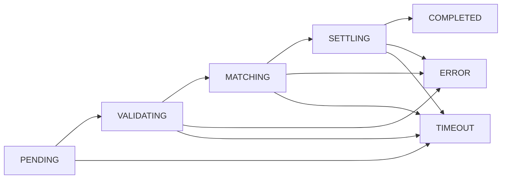

# Internal Response Coordination: Pipeline Status Management

## Overview

This document explains the internal coordination mechanism that enables the trading system to provide synchronous REST API responses for asynchronous order processing. It covers the internal status lifecycle, thread coordination patterns, and the technical implementation details hidden from API clients.

While trading bots see simple success/failure responses, the internal system manages complex multi-threaded coordination to bridge the synchronous-asynchronous gap.

## The Coordination Challenge

**The Problem:**
```
REST API Client              Multi-Threaded Pipeline
      |                            |
   Submit Order  ────────────────▶ │ Queue → Validator → Matcher → Publisher
      |                            │   ↓        ↓         ↓         ↓
   Wait for Response               │ 10ms     50ms      100ms     200ms
      |                            │
   ◀────────── Single Result       │ Need to coordinate across 4 threads!
```

**The Solution:** OrderResponseService coordinates the pipeline and delivers final results to waiting API threads.

## Internal Status Lifecycle

### Status Enumeration

The internal coordination uses these statuses to track order progression:

```python
class ResponseStatus(Enum):
    PENDING = "pending"           # Registered, awaiting processing
    VALIDATING = "validating"     # In validator thread
    MATCHING = "matching"         # In matching thread
    SETTLING = "settling"         # In trade publisher thread
    COMPLETED = "completed"       # Final result available
    TIMEOUT = "timeout"           # Expired without completion
    ERROR = "error"               # Pipeline error occurred
```

**Key Point:** These statuses are **never** seen by API clients. They are purely for internal coordination.

### Status Transition Flow



## Detailed Status Analysis

### PENDING - "Queued for Processing"

**When Used:**

- Order submitted to API but not yet picked up by validator thread
- System under load with orders backing up in queue

**Internal Functionality:**
```python
# API Thread
registration = coordinator.register_request(
    team_id="TEAM_001",
    timeout_seconds=5.0
)
registration.status = ResponseStatus.PENDING

# Queue the order
order_queue.put((order, team_info, registration.request_id))

# Wait for completion
result = coordinator.wait_for_completion(registration.request_id)
```

**Monitoring Value:**

- **Queue Depth**: How many orders stuck in PENDING
- **Queue Time**: How long orders spend in PENDING
- **Capacity Planning**: Understanding system load

**Error Scenarios:**

- Timeout if validator thread stops consuming queue
- Memory pressure if too many orders queue up

---

### VALIDATING - "Constraint Validation in Progress"

**When Used:**

- Order picked up by validator thread
- Running through constraint checks (position limits, order rates, etc.)

**Internal Functionality:**
```python
# Validator Thread
def validator_thread(coordinator, ...):
    while True:
        order, team_info, request_id = order_queue.get()

        # Update status
        coordinator.update_status(request_id, ResponseStatus.VALIDATING)

        # Run validation
        result = validation_service.validate_new_order(order, team_info)

        if result.status == "accepted":
            # Continue to matching
            coordinator.update_status(request_id, ResponseStatus.MATCHING)
            match_queue.put((order, team_info, request_id))
        else:
            # Validation failed - complete with error
            coordinator.complete_with_error(
                request_id=request_id,
                http_status=400,
                error_code=result.error_code,
                error_message=result.error_message
            )
```

**Monitoring Value:**

- **Validation Time**: Performance of constraint checking
- **Validation Errors**: Rate of constraint violations
- **Bottleneck Detection**: If validation becomes slow

**Error Scenarios:**

- Constraint violation -> 400 Bad Request to client
- Validation timeout -> 504 Gateway Timeout to client
- Exception during validation → 500 Internal Server Error

---

### MATCHING - "Exchange Matching in Progress"

**When Used:**

- Order submitted to exchange matching engine
- Waiting for matching engine to process order
- Typically 50-200ms depending on order complexity and market conditions

**Internal Functionality:**
```python
# Matching Thread
def matching_thread(coordinator, ...):
    while True:
        order, team_info, request_id = match_queue.get()

        # Update status
        coordinator.update_status(request_id, ResponseStatus.MATCHING)

        try:
            # Submit to exchange
            exchange_result = exchange.submit_order(order)

            # Continue to settlement
            coordinator.update_status(request_id, ResponseStatus.SETTLING)
            trade_queue.put((exchange_result, order, team_info, request_id))

        except Exception as e:
            # Exchange error - complete with error
            coordinator.complete_with_error(
                request_id=request_id,
                http_status=500,
                error_code="EXCHANGE_ERROR",
                error_message=str(e)
            )
```

**Monitoring Value:**

- **Matching Performance**: Exchange processing speed
- **Exchange Errors**: Rate of exchange failures
- **Order Book Impact**: Understanding market impact timing

**Error Scenarios:**

- Exchange internal error -> 500 Internal Server Error
- Matching timeout -> 504 Gateway Timeout
- Invalid order parameters -> 400 Bad Request

---

### SETTLING - "Trade Settlement in Progress"

**When Used:**

- Order matched by exchange, processing fills
- Calculating fees, updating positions
- Generating final response data

**Internal Functionality:**
```python
# Trade Publisher Thread
def trade_publisher_thread(coordinator, ...):
    while True:
        exchange_result, order, team_info, request_id = trade_queue.get()

        # Update status
        coordinator.update_status(request_id, ResponseStatus.SETTLING)

        try:
            # Process trade settlement
            response = trade_processing_service.process_trade_result(
                exchange_result, order, team_info
            )

            # Complete successfully
            coordinator.complete_successfully(
                request_id=request_id,
                order_response=response
            )

        except Exception as e:
            # Settlement error - complete with error
            coordinator.complete_with_error(
                request_id=request_id,
                http_status=500,
                error_code="SETTLEMENT_ERROR",
                error_message=str(e)
            )
```

**Monitoring Value:**

- **Settlement Performance**: Trade processing speed
- **Settlement Errors**: Rate of position/fee calculation failures
- **End-to-End Timing**: Total processing time measurement

**Error Scenarios:**

- Position update failure -> 500 Internal Server Error
- Fee calculation error -> 500 Internal Server Error
- Settlement timeout -> 504 Gateway Timeout

---

### COMPLETED - "Processing Complete"

**When Used:**

- All pipeline processing finished successfully
- Final result ready for API client
- Triggers API thread to unblock and return response

**Internal Functionality:**
```python
# OrderResponseService
def complete_successfully(self, request_id: str, order_response: OrderResponse):
    with self._lock:
        pending = self._pending_requests.get(request_id)
        if not pending:
            return  # Already completed or expired

        # Store final result
        api_response = ApiResponse(
            success=True,
            request_id=request_id,
            order_id=order_response.order_id,
            data=order_response.dict(),
            error=None,
            timestamp=datetime.now()
        )

        pending.status = ResponseStatus.COMPLETED
        self._response_cache[request_id] = api_response

        # Signal waiting API thread
        pending.completion_event.set()
```

**Monitoring Value:**

- **Success Rate**: Percentage of orders completing successfully
- **Total Processing Time**: End-to-end performance metrics
- **Cleanup Timing**: When to remove completed requests

**Cleanup Behavior:**

- Response cached briefly for API thread to retrieve
- Cleaned up after configurable delay (default 30 seconds)
- Metrics recorded before cleanup

---

### TIMEOUT - "Processing Exceeded Time Limit"

**When Used:**

- Request exceeded configured timeout (default 5 seconds)
- System overloaded or stuck
- Background cleanup process detects expired requests

**Internal Functionality:**
```python
# Background Cleanup Thread
def cleanup_expired_requests(coordinator):
    while True:
        time.sleep(coordinator.config.cleanup_interval_seconds)

        current_time = datetime.now()
        expired_requests = []

        with coordinator._lock:
            for request_id, pending in coordinator._pending_requests.items():
                if pending.timeout_at <= current_time:
                    expired_requests.append(request_id)

        # Complete expired requests with timeout
        for request_id in expired_requests:
            coordinator.complete_with_timeout(request_id)

def complete_with_timeout(self, request_id: str):
    with self._lock:
        pending = self._pending_requests.get(request_id)
        if not pending or pending.status.is_terminal():
            return

        # Create timeout response
        api_response = ApiResponse(
            success=False,
            request_id=request_id,
            order_id=None,
            data=None,
            error=ApiError(
                code="PROCESSING_TIMEOUT",
                message="Order processing exceeded time limit",
                details={
                    "timeout_ms": 5000,
                    "stage": pending.current_stage
                }
            ),
            timestamp=datetime.now()
        )

        pending.status = ResponseStatus.TIMEOUT
        self._response_cache[request_id] = api_response
        pending.completion_event.set()
```

**Monitoring Value:**

- **Timeout Rate**: System performance indicator
- **Timeout Stages**: Which pipeline stage causes most timeouts
- **Capacity Planning**: Understanding system limits

**Operational Impact:**

- Client receives 504 Gateway Timeout
- Operations team alerted to system performance issues
- Automatic cleanup prevents memory leaks

---

### ERROR - "Pipeline Error Occurred"

**When Used:**

- Exception or error at any pipeline stage
- Validation failure, exchange error, settlement failure
- System-level errors that can't be retried

**Internal Functionality:**
```python
def complete_with_error(self, request_id: str, http_status: int,
                       error_code: str, error_message: str,
                       error_details: Optional[Dict] = None):
    with self._lock:
        pending = self._pending_requests.get(request_id)
        if not pending or pending.status.is_terminal():
            return

        # Create error response
        api_response = ApiResponse(
            success=False,
            request_id=request_id,
            order_id=pending.order_id,
            data=None,
            error=ApiError(
                code=error_code,
                message=error_message,
                details=error_details or {}
            ),
            timestamp=datetime.now()
        )

        pending.status = ResponseStatus.ERROR
        self._response_cache[request_id] = api_response
        pending.completion_event.set()
```

**Monitoring Value:**

- **Error Rate**: System reliability indicator
- **Error Categories**: Which types of errors are most common
- **Error Stages**: Which pipeline stage fails most often

**Error Categories:**

- **Client Errors (400s)**: Validation failures, bad requests
- **Server Errors (500s)**: Exchange errors, settlement failures
- **Timeout Errors (504)**: Processing too slow

## Thread Coordination Patterns

### API Thread Pattern
```python
@router.post("/orders")
async def submit_order(request: OrderRequest, coordinator: OrderResponseService):
    # Register coordination request
    registration = coordinator.register_request(
        team_id=team.team_id,
        timeout_seconds=5.0
    )

    # Submit to pipeline
    order_queue.put((order, team_info, registration.request_id))

    # Wait for completion (blocks here)
    try:
        result = coordinator.wait_for_completion(
            registration.request_id,
            timeout_seconds=5.0
        )

        # Return appropriate HTTP response
        return JSONResponse(
            status_code=200 if result.success else get_error_status_code(result.error),
            content=result.dict()
        )

    except TimeoutError:
        # Should not happen due to internal timeout handling
        return JSONResponse(
            status_code=504,
            content={"error": "Request timeout"}
        )
```

### Pipeline Thread Pattern
```python
def pipeline_thread(coordinator, ...):
    while True:
        # Get work item
        work_item = input_queue.get()
        if work_item is None:  # Shutdown signal
            break

        request_id = work_item.request_id

        try:
            # Update status
            coordinator.update_status(request_id, current_stage_status)

            # Do work
            result = process_work_item(work_item)

            if is_final_stage:
                # Complete successfully
                coordinator.complete_successfully(request_id, result)
            else:
                # Pass to next stage
                coordinator.update_status(request_id, next_stage_status)
                next_queue.put(result)

        except Exception as e:
            # Handle error
            coordinator.complete_with_error(
                request_id=request_id,
                http_status=determine_status_code(e),
                error_code=get_error_code(e),
                error_message=str(e)
            )
```

## Monitoring and Observability

### Key Metrics to Track

**Request Lifecycle Metrics:**

- Requests by status (pending, validating, matching, settling, completed, timeout, error)
- Average time spent in each status
- Status transition rates
- Request completion rate

**Performance Metrics:**

- End-to-end processing time (95th, 99th percentile)
- Per-stage processing time
- Queue depths at each stage
- Thread utilization

**Error Metrics:**

- Error rate by stage
- Error rate by error code
- Timeout rate by stage
- Retry success rate (if implemented)

### Alerting Thresholds

**Performance Alerts:**

- Average processing time > 1 second
- 95th percentile processing time > 3 seconds
- Any stage taking > 500ms on average

**Reliability Alerts:**

- Error rate > 1%
- Timeout rate > 0.1%
- Queue depth > 100 orders at any stage

**Capacity Alerts:**

- Pending requests > 500
- Memory usage > 80%
- Thread CPU utilization > 90%

## Configuration and Tuning

### Timeout Configuration
```python
@dataclass
class CoordinationConfig:
    # How long to wait for pipeline completion
    default_timeout_seconds: float = 5.0

    # How many requests to track concurrently
    max_pending_requests: int = 1000

    # How often to clean up completed/expired requests
    cleanup_interval_seconds: int = 30

    # Stage-specific timeouts (optional)
    validation_timeout_seconds: float = 1.0
    matching_timeout_seconds: float = 2.0
    settlement_timeout_seconds: float = 2.0
```
## Summary

The internal response coordination system provides a sophisticated multi-threaded coordination mechanism that:

1. **Tracks orders** through each pipeline stage with detailed status
2. **Coordinates threads** using event-based signaling
3. **Manages timeouts** with automatic cleanup and error handling
4. **Provides observability** through comprehensive metrics and logging
5. **Delivers results** to API clients in a simple, consistent format

This complexity is completely hidden from trading bots, who see only the simple request-response pattern they expect.
