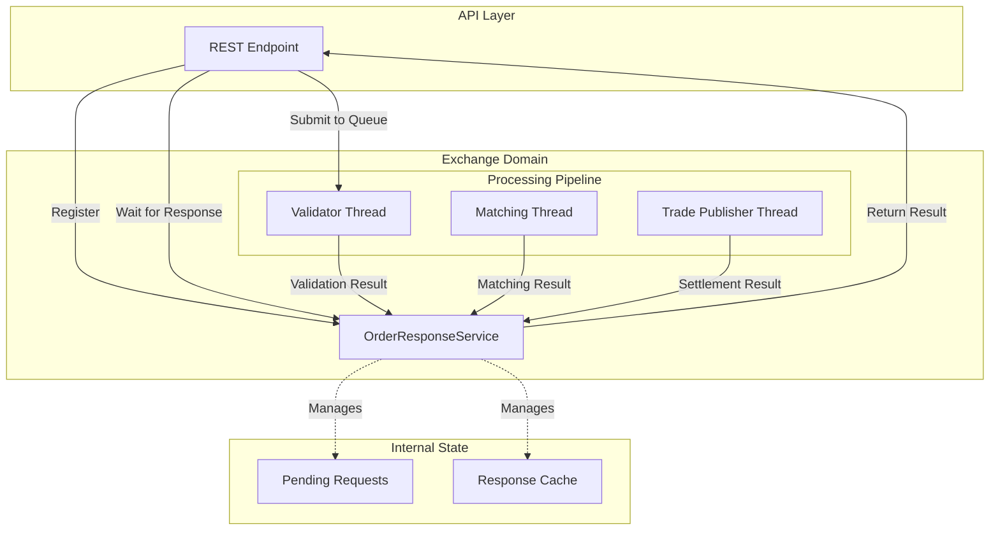

# Order Response Coordination

## Problem Statement

The Intern Trading Game faces a fundamental architectural challenge: **how to provide synchronous REST API responses for inherently asynchronous order processing workflows**.

When a trading client submits an order via `POST /exchange/orders`, they expect an immediate HTTP response indicating whether their order was accepted, rejected, or filled. However, the actual order processing happens asynchronously across multiple specialized threads:

```
HTTP Request → API Thread → Validator Thread → Matching Thread → Trade Publisher Thread
     ↓              ↓             ↓               ↓                    ↓
   Immediate    Queue Order   Validate       Match Order        Settle Trades
   Response     for Async     Constraints    Against Book       Update Positions
   Expected     Processing    (1-50ms)       (1-100ms)          (5-200ms)
```

The challenge: **How does the API thread wait for and return the final result from deep within the asynchronous processing pipeline?**

## Current Global State Solution

The system currently uses global dictionaries to coordinate responses:

```python
# In main.py - Global shared state
pending_orders: Dict[str, threading.Event] = {}
order_responses: Dict[str, Dict] = {}
```

**How it works:**
1. API thread generates unique `request_id` for incoming order
2. Creates `threading.Event` and stores in `pending_orders[request_id]`
3. Submits order to pipeline via queue
4. API thread calls `event.wait(timeout=5.0)` to block
5. Pipeline threads signal completion by setting event and storing result
6. API thread unblocks, retrieves result, returns HTTP response

**Problems with this approach:**
- **Violates service boundaries**: Global state accessed by all threads
- **Testing complexity**: Hard to mock and isolate for unit tests
- **Memory management**: No automatic cleanup of expired requests
- **Error handling**: Unclear ownership of error state transitions
- **Architecture compliance**: Contradicts service-oriented design principles

## Proposed Solution: OrderResponseService

The **OrderResponseService** will own and manage all order response coordination state and logic within the Exchange domain.

### Service Responsibilities

**Primary Responsibility**: Bridge synchronous REST API expectations with asynchronous order processing pipelines.

**Core Behaviors**:
1. **Request Registration**: When API receives order, register expectation for response
2. **Thread Coordination**: Provide thread-safe mechanism for pipeline threads to signal completion
3. **Response Aggregation**: Collect order status, fills, errors from various pipeline stages
4. **Timeout Management**: Handle cases where orders get stuck in pipeline
5. **Resource Management**: Automatic cleanup of completed/expired response tracking
6. **Error Translation**: Convert pipeline errors to appropriate HTTP status codes

### Architecture Overview



### Data Models

**Request Lifecycle States**:
```python
class ResponseStatus(Enum):
    PENDING = "pending"           # Registered, awaiting processing
    VALIDATING = "validating"     # In validator thread
    MATCHING = "matching"         # In matching thread
    SETTLING = "settling"         # In trade publisher thread
    COMPLETED = "completed"       # Final result available
    TIMEOUT = "timeout"           # Expired without completion
    ERROR = "error"               # Pipeline error occurred
```

**Coordination Data**:
```python
@dataclass
class PendingRequest:
    request_id: str
    order_id: Optional[str]       # Set after order creation
    team_id: str
    status: ResponseStatus
    completion_event: threading.Event
    registered_at: datetime
    timeout_at: datetime
    current_stage: str            # "validation", "matching", "settlement"
```

**Response Aggregation**:
```python
@dataclass
class ResponseResult:
    request_id: str
    order_id: Optional[str]
    status: ResponseStatus
    http_status_code: int         # 200, 400, 500, 504, etc.
    api_response: Dict            # Final ApiResponse data
    error_details: Optional[str]  # Error information if failed
    processing_time_ms: int       # Total coordination time
```

### Thread Interaction Patterns

**API Thread Registration**:
```python
# In REST endpoint
@router.post("/orders")
async def submit_order(request, coordinator: OrderResponseService):
    # 1. Register expectation
    registration = coordinator.register_request(
        team_id=team.team_id,
        timeout_seconds=5.0
    )

    # 2. Submit to pipeline
    order_queue.put((order, team_info, registration.request_id))

    # 3. Wait for result
    result = await coordinator.wait_for_completion(registration.request_id)

    # 4. Return HTTP response
    return JSONResponse(
        status_code=result.http_status_code,
        content=result.api_response
    )
```

**Pipeline Thread Notification**:
```python
# In validator thread
def validator_thread(coordinator: OrderResponseService, ...):
    while True:
        order, team_info, request_id = order_queue.get()

        # Process validation
        validation_result = validate_order(order, team_info)

        # Notify coordinator
        if validation_result.status == "accepted":
            coordinator.notify_stage_completion(
                request_id=request_id,
                stage="validation",
                order_id=validation_result.order_id,
                continue_processing=True
            )
        else:
            coordinator.notify_final_completion(
                request_id=request_id,
                stage="validation",
                http_status_code=400,
                api_response=create_rejection_response(validation_result)
            )
```

### Error Handling Strategy

**Timeout Scenarios**:
- **Validation Timeout**: Order stuck in validator queue → 504 Gateway Timeout
- **Matching Timeout**: Order stuck in matching engine → 504 Gateway Timeout
- **Settlement Timeout**: Trade stuck in publisher → 504 Gateway Timeout

**Pipeline Failures**:
- **Validation Failure**: Constraint violation → 400 Bad Request
- **Exchange Error**: Internal matching error → 500 Internal Server Error
- **Settlement Error**: Position update failure → 500 Internal Server Error

**Resource Management**:
- **Memory Limits**: Too many pending requests → 503 Service Unavailable
- **Thread Overload**: Coordinator overwhelmed → 503 Service Unavailable

**Error Translation Table**:
```python
ERROR_MAPPINGS = {
    ValidationError: (400, "Order validation failed"),
    ExchangeError: (500, "Internal exchange error"),
    TimeoutError: (504, "Order processing timeout"),
    ResourceLimitError: (503, "Service temporarily unavailable"),
    UnknownError: (500, "Unexpected error occurred")
}
```

### Performance Characteristics

**Expected Latencies**:
- **Registration**: < 1ms (memory operation)
- **Notification**: < 1ms (event signaling)
- **Cleanup**: < 10ms (background process)
- **Total Coordination Overhead**: < 5ms

**Memory Usage**:
- **Per Request**: ~200 bytes (PendingRequest + Event)
- **Cleanup Frequency**: Every 30 seconds
- **Max Pending**: 1000 concurrent requests (configurable)

**Thread Safety**:
- **RLock Protection**: All state mutations guarded
- **Atomic Operations**: Event signaling is atomic
- **Lock-Free Reads**: Status queries don't require locks

### Configuration

```python
@dataclass
class CoordinationConfig:
    default_timeout_seconds: float = 5.0
    max_pending_requests: int = 1000
    cleanup_interval_seconds: int = 30
    enable_metrics: bool = True
    enable_detailed_logging: bool = False
```

### Integration Points

**Service Dependencies**:
- **Exchange Venue**: Receives order lifecycle events
- **WebSocket Manager**: Coordinates with real-time notifications
- **Metrics Service**: Reports coordination performance
- **Logging Service**: Records request lifecycle for debugging

**Thread Integration**:
- **Validator Thread**: Notifies validation results
- **Matching Thread**: Notifies matching results
- **Trade Publisher Thread**: Notifies settlement results
- **Background Thread**: Performs periodic cleanup

### Business Value

**For Trading Operations**:
- **Immediate Feedback**: Traders get instant order confirmations
- **Error Clarity**: Clear error messages for failed orders
- **Performance Predictability**: Consistent response times

**For System Architecture**:
- **Service Isolation**: Clean boundaries between domains
- **Testability**: Easy to mock and unit test
- **Scalability**: Efficient memory and CPU usage
- **Maintainability**: Clear ownership of coordination logic

**For Development**:
- **Debugging**: Centralized logging of request lifecycles
- **Monitoring**: Metrics on coordination performance
- **Testing**: Isolated testing of coordination logic

## Migration Strategy

**Phase 1**: Implement OrderResponseService alongside existing global state
**Phase 2**: Update one thread at a time to use service
**Phase 3**: Switch API endpoints to use service
**Phase 4**: Remove global state dictionaries
**Phase 5**: Add advanced features (metrics, monitoring)

This approach ensures zero downtime and allows rollback if issues are discovered.

## Conclusion

The OrderResponseService eliminates global state while providing a robust, scalable solution for coordinating responses between synchronous REST APIs and asynchronous order processing pipelines. By owning all coordination logic within the Exchange domain, it maintains clean service boundaries while delivering the responsiveness that trading applications require.
